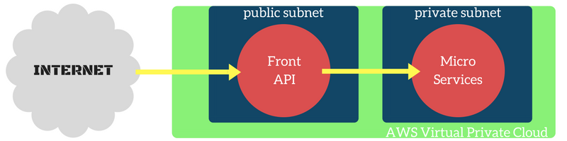
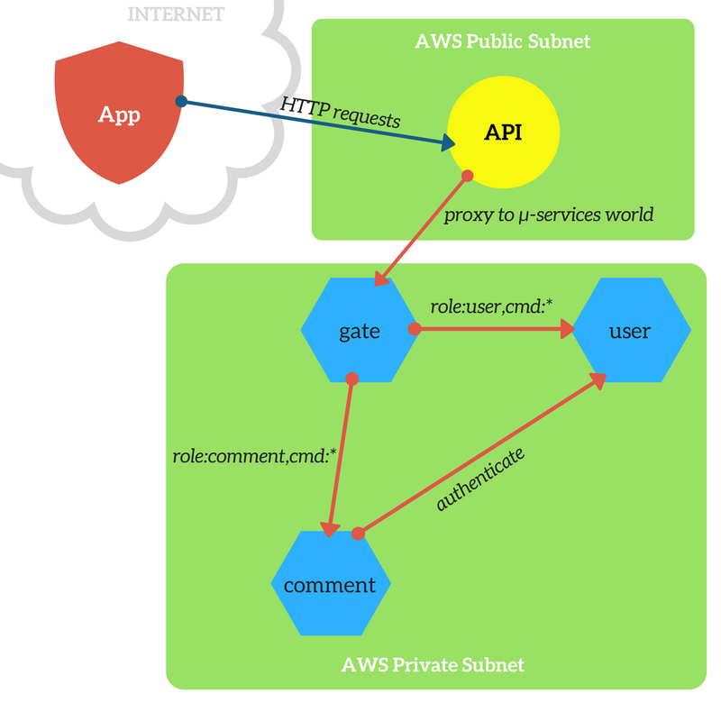

Interview test
==============

Using microservices, we will solve the following tasks:

# Create a login and registration system.

1. Users can have two roles: admin and user
20. They should be able to choose role upon registration
30. Tests for login routes and services

From the feature we can infer the messages we will need in our microservices system and we can also assign it a microservice:

Feature | Message
--- | ---
register | role:user,cmd:register
login | role:user,cmd:login

For simplifying the design we will choose to have one microservice handling both create and get user messages.

Thankfully, SenecaJS already has user, auth and admin plugins.
The `seneca-auth` plugin is not anymore usable with the new `seneca-web` versions which now has its own auth system in place.

In order to have a secure web site, we'd like to run our microservices in a protected environment. Our microservices should not be called from the internet. In AWS we can create private clusters with k8s and kops, whose instances will not be accessible from outside the cloud. To send messages into our microservices world we'll have an interface API as a bridge from internet HTTP requests and our private instances. See below an illustration of that design.



The user's role will be stored in the `name` field of the `user` entity provided by seneca user's plugin.

# Create a comment system for registered users

1. It should be a tree-style comment system
20. No limitation to the depth of the comments
30. Comments need approval from admins
40. Tests for login routes and services

Here as in the section above we will define our messages:

Feature | Message
--- | ---
list comments | role:comment,cmd:list
post comment | role:comment,cmd:save
reply to a comment | role:comment,cmd:reply
approve comment | role:comment,cmd:approve

The messages are quite simple and bound to our business valued features.\
They will be implemented in the `comment` microservice.

# Application

## Services design



## Commands

Open the shell and place yourself in the project's directory first.

Command name | Command
--- | ---
Start project | `npm start`
Monitor services | `npm run monitor`
Run tests | `npm test`

## Configuration

### Ports

App | Port
--- | ---
front API | 4222
gate Service | 4333

## TODOs

Look for `TODO` notes within the code with a simple `git grep`
and you'll find some unresolved dilemmas.

###### Current TODOs
```
services/comment/plugin.js:        //TODO
services/comment/plugin.js-        // the plugin 'seneca-store-query' enables to
services/comment/plugin.js-        // do 'or' queries with mysql and postgres...
```
